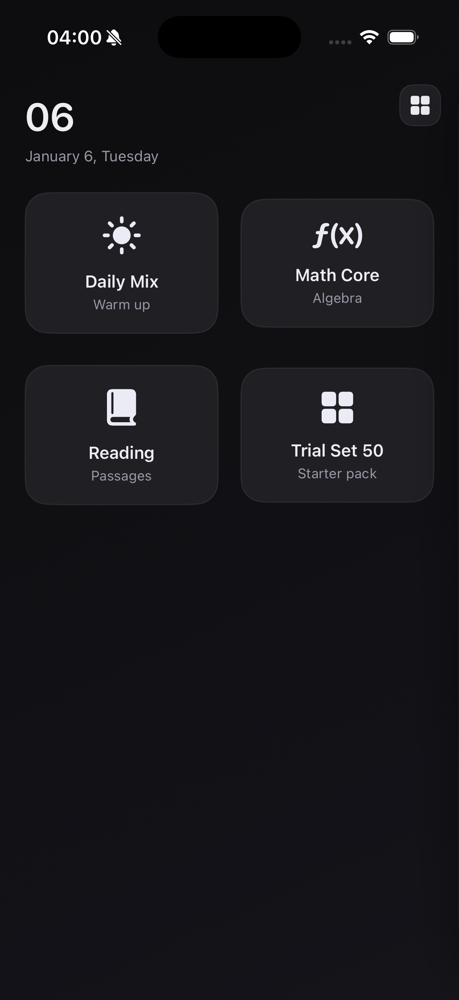
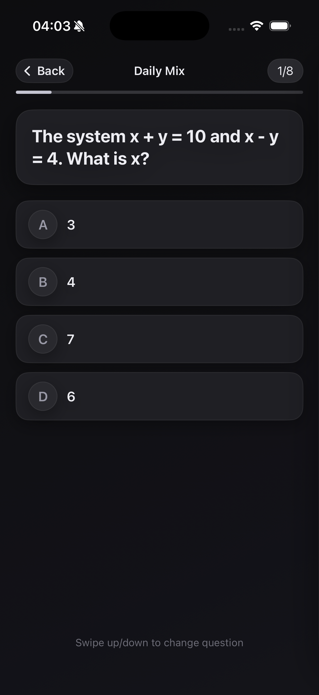
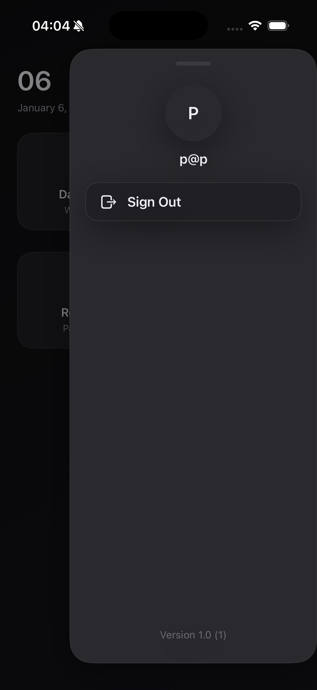

# iOS Student App Overview

## 概览
当前 iOS 端是一个面向学生的 SAT 练习 App，核心目标是让每个学生拥有一个专属 AI 老师（错题讲解、可反复追问、长期追踪）。应用采用 SwiftUI + StudentCore（SPM 包）分层，UI 负责展示与交互，业务与数据访问集中在 `StudentCore`。

## 业务流程
1. 启动应用
2. 未登录：进入登录/注册
3. 登录成功：拉取题库列表
4. 选择题库：创建练习 Session
5. 进入练习流：题目上下滑动切换，提交答案
6. 错题触发 AI 老师讲解与追问入口（Coach）
7. 打开 Session Overview：检查题目完成情况并提交
8. 退出练习：回到题库选择

## 页面说明
### 1) 登录/注册（AuthView）
- 输入 Email 与 Password
- 支持 Sign In / Create Account
- 异步请求期间显示加载态
- 错误提示以内联方式展示

### 2) 题库选择（QuestionBankSelectionView）
- 顶部显示日期与当天日号
- 以网格卡片展示题库
- 选择题库后进入练习 Session
- 加载中会遮罩并显示 Progress

### 3) 练习题目流（QuestionFeedView）
- 顶部显示返回按钮、题目进度与进度条
- 支持两类输入：
  - 选择题：选项按钮
  - 填空题：输入框提交
- 自动前进策略：
  - 选择题点击后自动前进
  - 填空题输入后 0.6s 自动提交并前进
- 题目切换：上下滑动切换题目
- 错题处理：展示 CoachStepSheet（选择卡点步）→ 拉取 AI 讲解

### 4) Session Overview（SessionOverviewView）
- 网格展示题号，已作答题号高亮
- 可点选题号回到题目
- 提交按钮用于提交剩余答案

### 5) 侧边面板（SidePanelView）
- 在“非练习中”状态显示入口按钮
- 展示用户缩写、邮箱与版本信息
- 支持 Sign Out

### 6) AI 老师对话（CoachChatView）
- 全科老师总线程，支持跨题追问
- 支持实时流式回复

## 数据与服务交互
- 拉取题库：查询 `question_banks`
- 创建 Session：RPC `start_practice_session`
- 提交答案：Function `submit_attempt`
- 错题步骤选择：Function `set_attempt_step`
- AI 讲解与追问：读取 `attempt_insights`
- 全科老师对话：Function `coach_chat` + Realtime `coach_thread_messages`
- 登录与注册：Supabase Auth

## 页面截图
### 题库选择

### 练习题目流

### 侧边面板

## 已实现但未接通
- `SessionSummaryView`：代码已实现，但当前流程未跳转到该页面。

## 参考实现位置
- `ios/StudentApp/StudentApp/ContentView.swift`
- `ios/StudentApp/StudentApp/Views/QuestionBankSelectionView.swift`
- `ios/StudentApp/StudentApp/Views/QuestionFeedView.swift`
- `ios/StudentApp/StudentApp/Views/SessionOverviewView.swift`
- `ios/StudentApp/StudentApp/Views/SidePanelView.swift`
- `ios/StudentApp/StudentApp/ViewModels/AppViewModel.swift`
- `ios/StudentApp/StudentApp/ViewModels/PracticeFlowViewModel.swift`
- `ios/StudentCore/Sources/StudentCore/SupabasePracticeService.swift`
